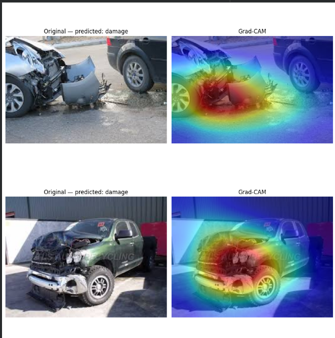
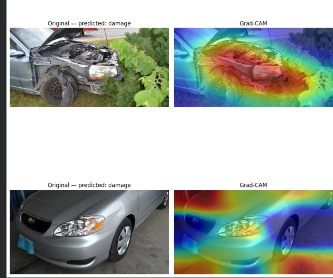
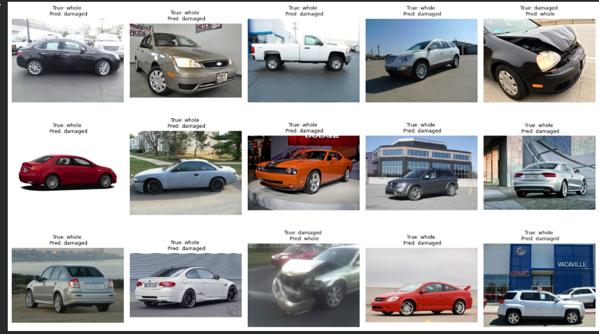

# Car Damage Detector
 
A deep learning model that classifies car images as damaged or clean, built as a project to learn PyTorch from scratch.
 
## Demo
 
Try it live: [car-damage-detector](https://car-damage-detector-ixwwpu8iftrknha3e2hccu.streamlit.app/)

> Note: the app may be asleep due to inactivity — if so, click "Yes, get this app back up!" and wait a few seconds for it to spin up.

Upload a photo of a car and the app returns a prediction (damaged/clean) with a confidence score.
 
## Problem
 
Automatically identifying vehicle damage from images has real-world use cases in insurance claims processing and resale/valuation platforms, where manual inspection is slow and inconsistent. This project builds a binary image classifier to automate that first-pass judgment call.
 
## Approach
 
**Dataset:** Kaggle car damage dataset, pre-split into training (1,840 images) and validation (460 images) sets, evenly balanced between "damage" and "whole" classes (920/920 in training).
 
**Model:** Transfer learning with a pretrained ResNet18, with the final fully-connected layer replaced for binary classification.
 
**Training:** Adam optimizer, cross-entropy loss, trained on Google Colab GPU with:
- A learning rate scheduler (`ReduceLROnPlateau`) to reduce the LR when validation loss plateaued
- Checkpointing to save the best-performing model based on validation accuracy
- Data augmentation (random horizontal flip, rotation, color jitter) to improve generalization, particularly to reduce false positives on clean cars
**Evaluation:** Confusion matrix, precision/recall/F1 (via `sklearn.classification_report`), ROC/AUC curve, Grad-CAM heatmaps for interpretability, and a misclassified-image grid to visually inspect model errors.

### Grad-CAM Examples

*Two correctly classified damaged car examples — heatmaps focus on the visible damage regions.*

*One correct clean prediction and one misclassification (clean car predicted as damaged) — the heatmap on the misclassified example shows the model focusing on shadows/reflections rather than actual damage.*

### Misclassified Examples

*Validation images the model got wrong (15 in total). Errors mostly involve lighting, angle, or image quality issues rather than a consistent failure pattern.*

**Deployment:** Packaged as a Streamlit web app, with the trained model loaded via `torch.load(..., map_location='cpu')` for CPU-only inference on Streamlit Community Cloud.
 
## Results
 
- Validation accuracy: ~97%
- Precision / Recall / F1: ~0.97 across both classes (balanced performance, no class bias)
- ROC AUC: 0.94
- Confusion matrix showed strong, balanced performance after data augmentation
## Tech Stack
 
- Python, PyTorch, torchvision
- pandas, scikit-learn, Matplotlib
- Streamlit (deployment)
- Google Colab (GPU training)

 
## Notes / Limitations

- **No "not a car" class.** The model was only trained to distinguish damaged vs. clean cars, so it has no way to reject inputs that aren't cars at all — feeding it an unrelated image still forces a damaged/clean prediction with a confidence score, which is misleading. A future version could add a third "not a car" class, or a separate detection step before classification.
- **Mixed results outside the training distribution.** On real-world photos (different lighting, angles, backgrounds, or camera types than the Kaggle dataset), predictions are inconsistent — some are correctly classified, others aren't. This points to a generalization gap common in models trained on a single, stylistically consistent dataset, and suggests validation metrics alone overstate real-world reliability.
- **Possible next steps:** collect a small out-of-distribution test set (e.g. random car photos from the web) to quantify the real-world drop-off, and/or expand training data diversity to close the gap.
